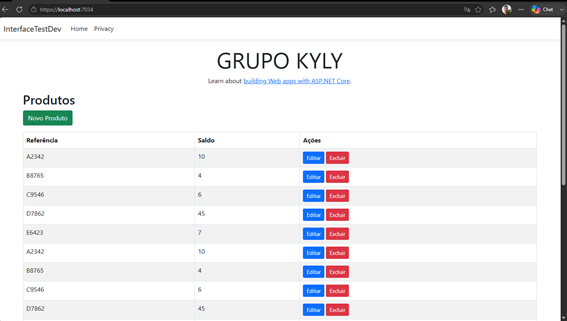
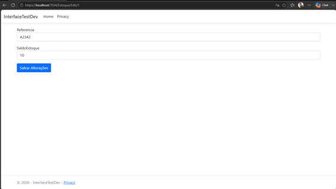
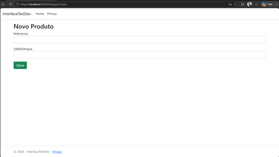
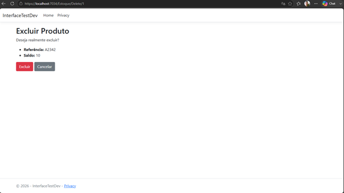

# 📦 Sistema de Gerenciamento de Estoque - ASP.NET Core MVC

Projeto desenvolvido a partir de um desafio técnico para uma vaga de Desenvolvedor.

O desafio original consistia em implementar a lógica de gerenciamento de estoque em uma aplicação Console utilizando C#. Após concluir o desafio, evoluí o projeto para uma aplicação Web utilizando **ASP.NET Core MVC**, adicionando uma interface gráfica para interação com o usuário e organizando a aplicação seguindo o padrão MVC.

---

## 🚀 Tecnologias utilizadas

- C#
- .NET 8
- ASP.NET Core MVC
- Razor Views
- Bootstrap
- HTML5
- CSS3

---

## 📂 Estrutura do Projeto

```text
Controllers
    EstoqueController

Models
    EstoqueProduto

Servicos
    GerenciadorEstoque

Views
    Estoque
        Index.cshtml

wwwroot
```

---

## 📋 Funcionalidades

- Listagem de produtos em estoque
- Consulta do saldo por referência
- Verificação de disponibilidade de estoque
- Separação da lógica de negócio da interface
- Interface Web utilizando o padrão MVC

---

## 🧠 Regras de negócio implementadas

O projeto possui uma classe responsável pelo gerenciamento do estoque (`GerenciadorEstoque`), contendo as seguintes funcionalidades:

- Verificar se existe quantidade suficiente de um produto
- Buscar o saldo de uma referência
- Exibir a listagem completa do estoque

---

## 🏗️ Arquitetura

O projeto segue o padrão MVC.

```text
Usuário
     │
     ▼
Controller
     │
     ▼
GerenciadorEstoque
     │
     ▼
Model
     │
     ▼
View (Razor)
```

A regra de negócio permanece isolada da camada de apresentação, facilitando manutenção e futuras evoluções da aplicação.

---

## 📸 Demonstração

### Tela principal (listagem do estoque)

<p align="center">
    
</p>

---

### Editar estoque

<p align="center">
    
</p>

---

### Criar novo produto

<p align="center">
    
</p>

---

### Deletar produto

<p align="center">
    
</p>

---

## ▶️ Como executar

Clone o repositório

```bash
git clone https://github.com/LenilsonJr27/Interface-TesteDeveloper.git
```

Acesse a pasta

```bash
cd Interface-TesteDeveloper 
```

Execute

```bash
dotnet run
```

ou abra a solução no Visual Studio e pressione **F5**.

---

## 🎯 Objetivo

O objetivo deste projeto foi praticar:

- Programação Orientada a Objetos
- Organização em camadas
- ASP.NET Core MVC
- Separação entre interface e regra de negócio
- Evolução de um projeto Console para uma aplicação Web

---

## 👨‍💻 Autor

**Lenilson Júnior**

LinkedIn: https://www.linkedin.com/in/lenilson-junior-540a5b22b/

GitHub: https://github.com/LenilsonJr27

Instagram: https://www.instagram.com/lenilsonjr_/
